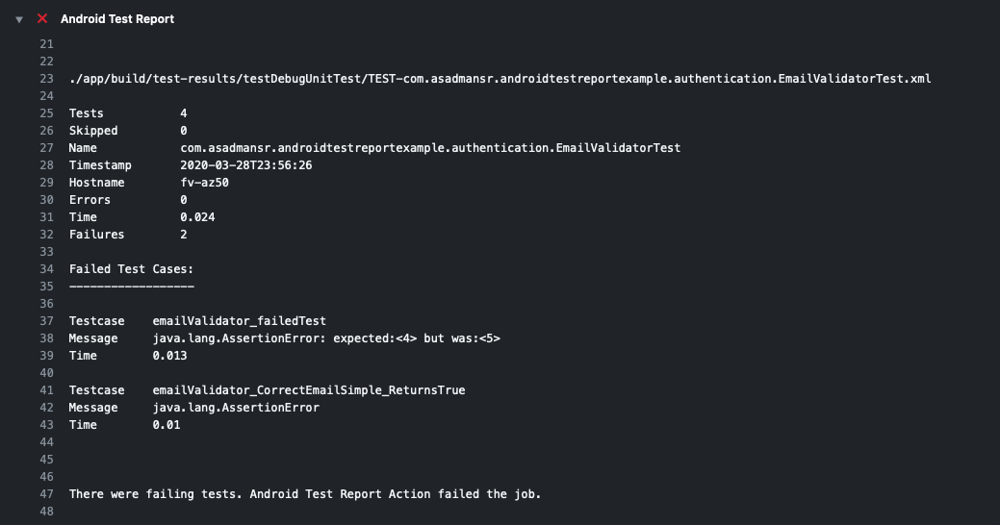

# Android Test Report Action

[](https://github.com/asadmansr/android-test-report-action/releases)
[](https://github.com/marketplace/actions/android-test-report-action)

GitHub Action that prints Android test xml reports.

## Usage

The Android Test Report action parses the xml reports produced by the tests and outputs data for all test suites.

```yml
name: Android CI
on: [push]

jobs:
  #####################################
  # Test job to run Android unit tests
  ##################################### 
  test:
    runs-on: ubuntu-latest
    steps:
    - uses: actions/checkout@v1

    - name: set up JDK 1.8
      uses: actions/setup-java@v1
      with:
        java-version: 1.8

    - name: Unit Test
      run: ./gradlew testDebugUnitTest
      continue-on-error: true # IMPORTANT: allow pipeline to continue to Android Test Report step

    - name: Android Test Report
      uses: asadmansr/android-test-report-action@v1.1.0
```
#### Note
To use this Action, create a test job in the workflow. As a step, execute the unit test command using gradle. Make sure to include `continue-on-error` to prevent the job failing prior to displaying the error. Then, use the Android Test Report Action to display the reports. The Action will automatically pass or fail the job depending on the test results.

## Output



## Example

To learn how to use this Action in an Android application, check out the following example repository:
https://github.com/asadmansr/android-test-report-action-example

- master branch: Passed pipeline as all the tests passed
- failed-pipeline branch: Failed pipeline as some of the tests failed