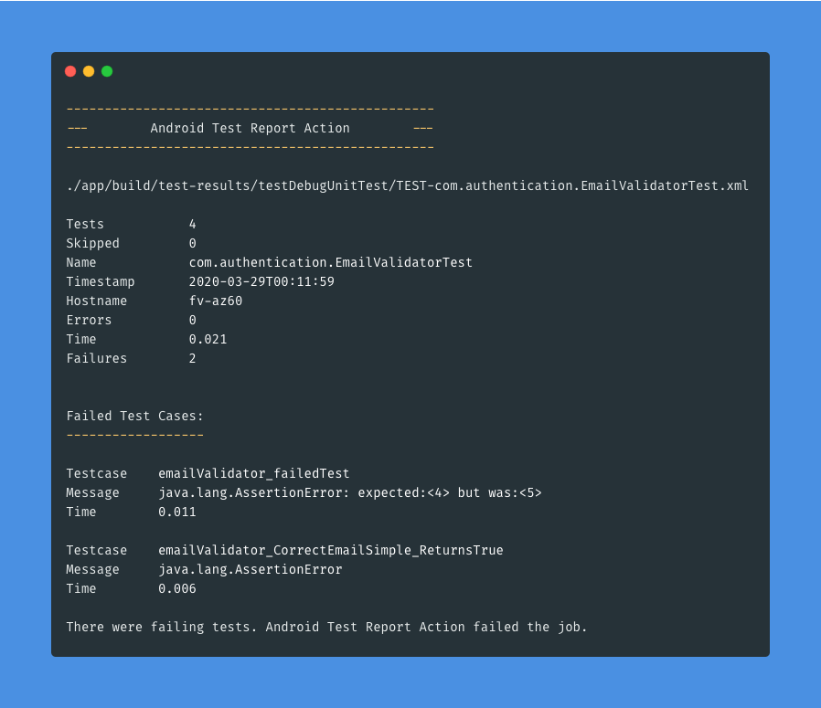

# Android Test Report Action

[](https://github.com/asadmansr/android-test-report-action/releases)
[](https://github.com/marketplace/actions/android-test-report-action)

GitHub Action that prints Android test xml reports.



<br>

## Getting Started

Add the following action to your GitHub Actions workflow.

```yml
- name: Android Test Report
  uses: asadmansr/android-test-report-action@v1.2.0
```

<br>

## Basic Usage

After executing the tests, the Android Test Report action parses all of the XML reports and outputs the results in a structured way.

```yml
name: Android CI
on: [push]

jobs:
  # Test job to run Android unit tests
  test:
    runs-on: ubuntu-latest
    steps:
    - uses: actions/checkout@v1

    - name: set up JDK 1.8
      uses: actions/setup-java@v1
      with:
        java-version: 1.8

    - name: Unit Test
      run: ./gradlew testDebugUnitTest
      continue-on-error: true # IMPORTANT: allow pipeline to continue to Android Test Report step

    - name: Android Test Report
      uses: asadmansr/android-test-report-action@v1.2.0
```
#### Note
The workflow must contain the unit test job prior to running the Android Test Report action. Make sure to include `continue-on-error: true` in the unit test step to prevent the job to fail before running the action. **The action will automatically pass or fail the job depending on the test results.**

<br>

## Alternate Usage

If the basic usage fails to meet the requirement, such as avoiding to use `continue-on-error` or executing the test on a MacOS machine, consider the following example below.

```yml
jobs:
  test:
    runs-on: macos-latest
    steps:
      ...
      - name: Unit Test
        run: ./gradlew testDebugUnitTest

      - name: Upload Test Reports Folder
        uses: actions/upload-artifact@v2
        with:
          name: reports
          path: app/build/test-results # path to where the xml test results are stored
        
  report:
    runs-on: ubuntu-latest
    needs: test # The report job will run after test job
    steps:
      - name: Download Test Reports Folder
        uses: actions/download-artifact@v2
        with:
          name: reports

      - name: Android Test Report
        uses: asadmansr/android-test-report-action@v1.2.0
```

<br>

## Output


<br>

## Sample Project

To learn how to use this action in an Android application, check out the following example repository:
https://github.com/asadmansr/android-test-report-action-example

- master branch: Passed pipeline as all the tests passed
- failed-pipeline branch: Failed pipeline as some of the tests failed